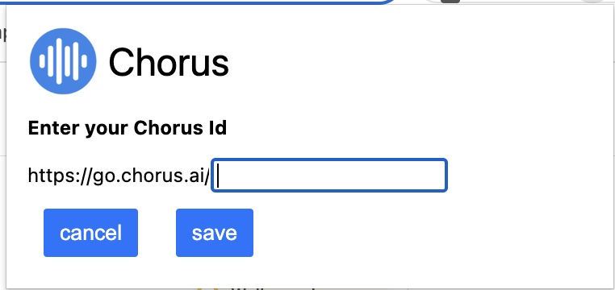
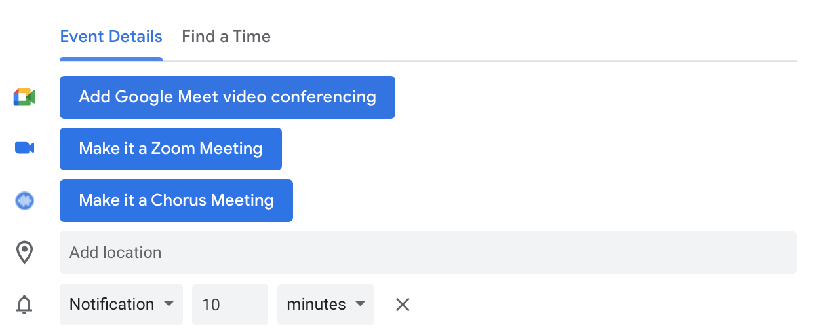
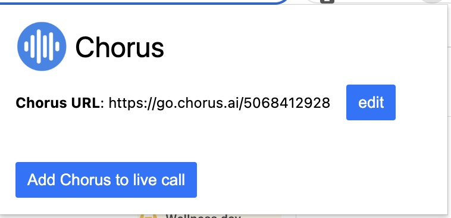

# Chorus Chrome Extension

This is a Chrome extension for use with Chorus.ai. Once added, it provides a button within your Google Calendar events to be able to add your own Chorus link to meetings.

This extension assumes you have the Zoom Scheduler Chrome extension already installed.

# Installing extension

This is currently a dev only version of this extension, so it will need to be manually added to your extensions list.

- Download the zip file of the [latest release](https://github.com/mikedavis77/chorus-chrome-extension/releases) to your local machine
- Unzip the file to a directory
- Navigate to your Chrome extensions - `chrome://extensions`
- Enable 'Developer mode' (toggle top right hand corner)
- Click the button 'Load unpacked'
- Select the directory that you have unzipped the zip file to
- Enable the extension
- You should see the 'Chorus.ai Scheduler' in the list of extensions

# How to use this extension?

Once the extension is enabled, you will need to set your personal Chorus id.

- Click on the extension icon
- Click the 'edit' button
- Enter your personal Chorus id
- Click the 'save' button

### Adding to calendar

Once this has been done, when editing one of your Google Calendar events you will see an additional button called 'Make it a Chorus Meeting'. Clicking this will add your personal Chorus meeting URL to the meeting invite.

### Add to a live call

Clicking on the extension icon also provides a link to add Chrous to a live Zoom call. This takes you to the relevant Chorus page where you can paste in the Zoom link to add Chorus to it.

